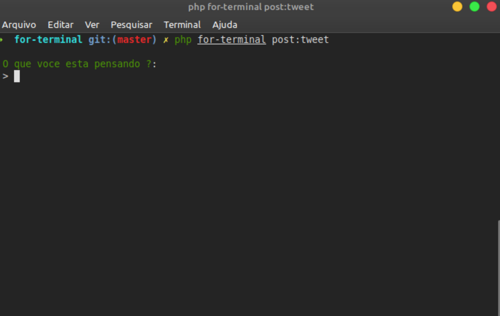

# Twitter for terminal
  

Ideia que voce possa postar tweets direto do seu terminal é tambem listar sua timeline mais recente.Esse projeto foi desenvolvido com Laravel-zero um micro-framework para construir aplicativos de linha de comando.
* [[Laravel-zero](https://laravel-zero.com/)] - micro-framework baseado no Laravel

## Como usar o projeto ?
* Clone o projeto.
* Não se esqueça de rodar ```composer install``` para instalar a pasta vendor.
* Faça uma [conta desenvolvedor no twitter](https://developer.twitter.com/en) é crie um aplicativo o passo a passo bem simples é intuivo no site deles.
* Depois disso, voce vai pegar chave de api,chave de api secreta o token é token secreto colocar no arquivo .env pois eles vão dar acesso sua conta.

## Comandos do projeto

``` php for-terminal user:teste ```
  Para testar use esse comando é ele tem que retorna seu username.

  ``` php for-terminal post:tweet ```
  para postar os Tweets na sua conta.


  ``` php for-terminal user:timeline ```
  para listar os Tweets e Retweets postados mais recentes da sua timeline.

## API do twitter
  As APIs tem limites normalmente e o  endpoit usado para postar os tweets tem um limite onde voce so pode postar somente 300 Tweets durante um periodo de 3 horas.

### O que falta melhorar ?
  Fazer com que os comandos funcionem fora da pasta do projeto. Eu sinceramente não sei como fazer isso ainda.

***
***Se algo não estiver funcionando faça uma issue ou se voce tem alguma ideia como faz para que os comandos funcionem fora da pasta do projeto ou sei la voce ta afim de comentar algo que eu possa melhorar, fique a vontade...***


<!--   -->